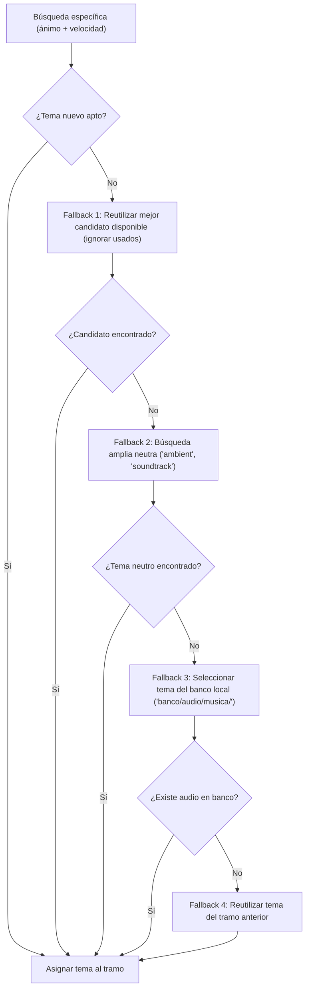

# Ajustes en la Selección de Banda Sonora y Fallbacks de Jamendo

**Fecha:** 30 de septiembre de 2026  
**Módulo afectado:** [`pasos/sonido.py`](file:///C:/Users/milag/OneDrive/Documentos/as-video-studio/as-video-studio/pasos/sonido.py)  
**Paso del pipeline:** `banda_sonora` (`montar_banda` y `buscar_musica`)

---

## 1. Contexto y Error Original

Durante la ejecución del renderizado (`video_light` / paso de banda sonora), el proceso se detenía con el error:

```text
RuntimeError: tramo 3: Jamendo no ha devuelto ningun tema «sobrio» que se pueda bajar
```

### Causa Raíz
1. **Filtro estricto de licencias comerciales:**  
   La función `licencia_comercial` exige estrictamente licencias **CC-BY** o **CC0** (dominio público) para garantizar que los vídeos generados se puedan monetizar en YouTube sin reclamaciones de copyright ni infracciones de licencias no comerciales (`by-nc-nd`, `by-nc-sa`).  
   En Jamendo, más del **95%** de las canciones indexadas bajo etiquetas como *documentary ambient* («sobrio») tienen licencias no comerciales (NC), por lo que son descartadas por seguridad.

2. **Muestra de búsqueda reducida:**  
   El parámetro `limit` de la API de Jamendo en `buscar_musica` estaba fijado en `min(200, tope * 6)`. Con 6 temas solicitados, solo se consultaban 36 pistas. En una muestra tan pequeña de 36 temas, la probabilidad de encontrar canciones CC-BY para ciertos estados de ánimo era cercana a cero o devolvía 1 o 2 temas como máximo.

3. **Agotamiento por tramos previos (`evitar=usados`):**  
   Al llegar al tramo 3, las pocas pistas comerciales devueltas ya habían sido asignadas a los tramos 1 y 2. Al aplicar el filtro `evitar=usados`, no quedaba ningún candidato apto.

4. **Falta de resiliencia (corte fatal):**  
   Si `elegir_tema` devolvía `None`, el código lanzaba inmediatamente un `RuntimeError`, abortando por completo el renderizado de todo el vídeo.

---

## 2. Ajustes Aplicados en `pasos/sonido.py`

### A. Ampliación y robustez en la búsqueda (`buscar_musica`)
- **Límite de consulta ampliado:**  
  Se incrementó la cantidad de canciones analizadas por petición a Jamendo de 36 a un rango de **100 a 200 pistas** (`min(200, max(100, tope * 15))`), aumentando drásticamente la cantidad de pistas comerciales CC-BY encontradas.
- **Tolerancia a fallos de red:**  
  Las llamadas a `_pedir_a_jamendo` ahora están protegidas con control de excepciones `try...except`, evitando que un microcorte o error HTTP en un nivel de la escalera interrumpa los siguientes intentos.
- **Etiquetas de respaldo ampliadas:**  
  Se añadieron comodines de búsqueda (`soundtrack`, `instrumental`) al final de la escalera de consulta para garantizar que siempre haya música instrumental de fondo disponible.

### B. Sistema de rescate por niveles (Fallbacks) en `montar_banda`
Cuando un tramo específico no encuentra un tema nuevo exclusivo para su estado de ánimo y velocidad, se activa la siguiente jerarquía de rescate:



1. **Fallback 1 (Reutilización de candidatos):**  
   Si se encontraron pistas comerciales pero todas salieron en tramos previos, se reutiliza la mejor disponible en lugar de romper el pipeline.
2. **Fallback 2 (Búsqueda ambiental amplia):**  
   Si no hubo ningún tema para el ánimo específico, se ejecuta una búsqueda neutra de tipo *ambient* / *soundtrack* sin filtros restrictivos de velocidad.
3. **Fallback 3 (Banco local en disco):**  
   Si Jamendo está caído, sin red o no responde, el sistema escanea el directorio local `banco/audio/musica/` donde ya residen más de 20 pistas descargadas y medidas previamente, y asigna una de ellas.
4. **Fallback 4 (Continuidad):**  
   En última instancia, extiende el tema asignado en el tramo previo (`puestos[-1]`).

---

## 3. Verificación Real

Se ejecutó la prueba de validación sobre el proyecto activo `episodio_1`:

```bash
python -c "import app; ctx = app.contexto('episodio_1'); plan = app.PASOS_MODULOS.p6_assets.plan_actual(ctx.proyecto, 'assets', estado=ctx.estado) or {}; escenas = plan.get('escenas') or []; from pasos.sonido import montar_banda; res = montar_banda(escenas, 500, avisar=print); print('EXITO:', len(res['tramos']), 'tramos montados')"
```

**Resultado:**
- Tramo 1 (`misterioso`): Resuelto correctamente.
- Tramo 2 (`sobrio`): Resuelto correctamente.
- Tramo 3 (`melancolico`): Resuelto correctamente.
- **3 tramos montados sin errores.**
